<http://www.iocoder.cn/Spring-Cloud/Feign/?github>

摘要: 原创出处 http://www.iocoder.cn/Spring-Cloud/Feign/ 「芋道源码」欢迎转载，保留摘要，谢谢！

- [1. 概述](http://www.iocoder.cn/Spring-Cloud/Feign/)
- [2. 快速入门](http://www.iocoder.cn/Spring-Cloud/Feign/)
- [3. 自定义 Feign 配置](http://www.iocoder.cn/Spring-Cloud/Feign/)
- [4. 继承特性](http://www.iocoder.cn/Spring-Cloud/Feign/)
- [5. 复杂参数](http://www.iocoder.cn/Spring-Cloud/Feign/)
- [6. Feign 单独使用](http://www.iocoder.cn/Spring-Cloud/Feign/)
- [7. HTTP 客户端](http://www.iocoder.cn/Spring-Cloud/Feign/)
- [8. 请求重试](http://www.iocoder.cn/Spring-Cloud/Feign/)
- [9. Feign 与 RestTemplate 的对比](http://www.iocoder.cn/Spring-Cloud/Feign/)
- [10. Feign 主要组件](http://www.iocoder.cn/Spring-Cloud/Feign/)
- [666. 彩蛋](http://www.iocoder.cn/Spring-Cloud/Feign/)

------

------

> 本文在提供完整代码示例，可见 https://github.com/YunaiV/SpringBoot-Labs 的 [labx-03-spring-cloud-feign](https://github.com/YunaiV/SpringBoot-Labs/tree/master/labx-03-spring-cloud-feign) 目录。
>
> 原创不易，给点个 [Star](https://github.com/YunaiV/SpringBoot-Labs/stargazers) 嘿，一起冲鸭！

# 1. 概述

**📖 Feign**

[Feign](https://github.com/OpenFeign/feign) 是由 Netflix 开源的**声明式的 HTTP 客户端**，目前已经捐献给 [OpenFeign](https://github.com/OpenFeign) 社区。

> Feign makes writing java http clients easier

通过使用定义简单的接口，并声明 Feign 提供的**注解**，来实现 HTTP 的调用。示例代码如下：


```
import feign.Feign;
import feign.Param;
import feign.RequestLine;

// 商品 API
interface ProductAPI {

    // 获得商品详情
    @RequestLine("POST /products/{id}")
    String get(@Param("id") Integer id);

}

public class FeignDemo {

    public static void main(String[] args) {
        // 创建 ProductAPI 对象
        ProductAPI productAPI = Feign.builder().target(ProductAPI.class,
                "http://www.iocoder.cn"); // 目标地址

        // 调用获得商品
        String product = productAPI.get(1);
        System.out.println(product);
    }

}
```


- 是不是非常方便，我们仅仅创建了 ProductAPI 接口，并使用了 Feign 定义的 `@RequestLine` 和 `@Param` 注解，就实现了一个获取商品详情的 HTTP API 的调用。

**📖 Spring Cloud OpenFeign**

[Spring Cloud OpenFeign](https://github.com/spring-cloud/spring-cloud-openfeign) 组件，将 Feign 集成到 Spring Cloud 体系中，实现服务的**声明式 HTTP 调用**。相比使用 RestTemplate 实现服务的调用，Feign 简化了代码的编写，提高了代码的可读性，大大提升了开发的效率。

Spring Cloud OpenFeign 除了支持 Feign 自带的注解之外，额外提供了对 JAX-RS 注解、SpringMVC 注解的支持。特别是对 **SpringMVC 注解**的支持，简直是神来之笔，让我们不用学习 Feign 自带的注解，而直接使用超级熟悉的 SpringMVC 注解。

同时，Spring Cloud OpenFeign 进一步将 Feign 和 [Ribbon 整合](https://github.com/spring-cloud/spring-cloud-openfeign/blob/2.2.x/spring-cloud-openfeign-core/src/main/java/org/springframework/cloud/openfeign/loadbalancer/FeignLoadBalancerAutoConfiguration.java)，提供了负载均衡的功能。另外，Feign 自身已经完成和 [Hystrix 整合](https://github.com/OpenFeign/feign/tree/master/hystrix)，提供了服务容错的功能。

如此，我们基于注解，极其简单的实现服务的调用，并且具有负载均衡、服务容错的功能。

# 2. 快速入门

> 示例代码对应仓库：
>
> - 服务提供者：[`labx-03-sc-feign-demo01-provider`](https://github.com/YunaiV/SpringBoot-Labs/blob/master/labx-03-spring-cloud-feign/labx-03-sc-feign-demo01-provider)
> - 服务消费者：[`labx-03-sc-feign-demo01-consumer`](https://github.com/YunaiV/SpringBoot-Labs/blob/master/labx-03-spring-cloud-feign/labx-03-sc-feign-demo01-consumer)

本小节，我们来搭建一个 Spring Cloud OpenFeign 组件的快速入门示例。步骤如下：

- 首先，搭建一个服务提供者 `demo-provider`，启动 2 个实例，注册服务到 Nacos 中。
- 然后，搭建一个服务消费者 `demo-consumer`，使用 Ribbon 进行**负载均衡**，使用 Feign **声明式调用**服务提供者 `demo-provider` 的 HTTP 接口。

## 2.1 搭建服务提供者

创建 [`labx-03-sc-feign-demo01-provider`](https://github.com/YunaiV/SpringBoot-Labs/blob/master/labx-03-spring-cloud-feign/labx-03-sc-feign-demo01-provider) 项目，作为服务提供者 `demo-provider`。最终项目代码如下图所示：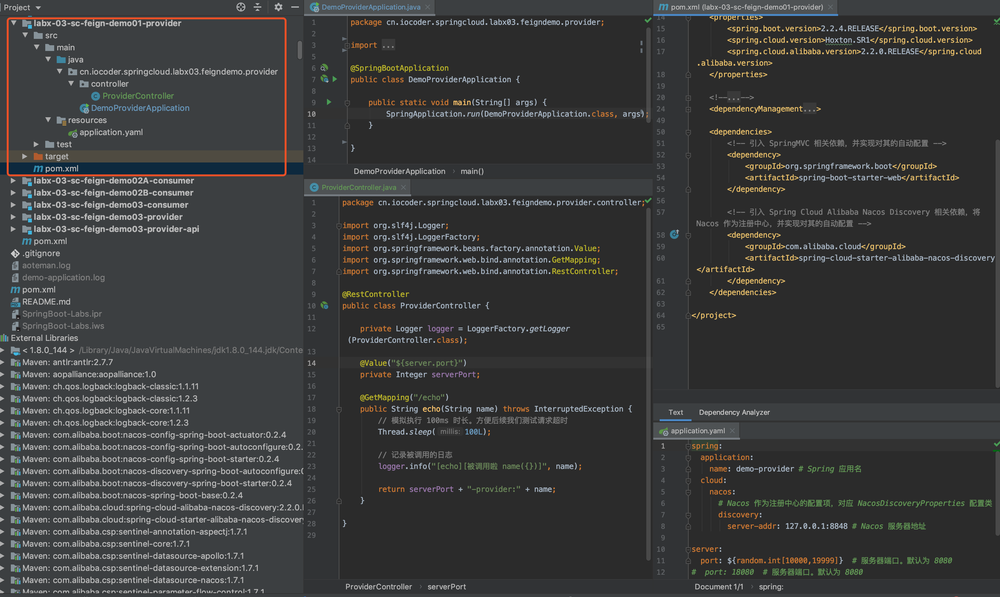

### 2.1.1 引入依赖

在 [`pom.xml`](https://github.com/YunaiV/SpringBoot-Labs/blob/master/labx-03-spring-cloud-feign/labx-03-sc-feign-demo01-provider/pom.xml) 文件中，主要引入 Spring Cloud **Nacos** Discovery 相关依赖。代码如下：


```
<?xml version="1.0" encoding="UTF-8"?>
<project xmlns="http://maven.apache.org/POM/4.0.0"
         xmlns:xsi="http://www.w3.org/2001/XMLSchema-instance"
         xsi:schemaLocation="http://maven.apache.org/POM/4.0.0 http://maven.apache.org/xsd/maven-4.0.0.xsd">
    <parent>
        <artifactId>labx-01</artifactId>
        <groupId>cn.iocoder.springboot.labs</groupId>
        <version>1.0-SNAPSHOT</version>
    </parent>
    <modelVersion>4.0.0</modelVersion>

    <artifactId>labx-03-sc-feign-demo01-provider</artifactId>

    <properties>
        <spring.boot.version>2.2.4.RELEASE</spring.boot.version>
        <spring.cloud.version>Hoxton.SR1</spring.cloud.version>
        <spring.cloud.alibaba.version>2.2.0.RELEASE</spring.cloud.alibaba.version>
    </properties>

    <!--
        引入 Spring Boot、Spring Cloud、Spring Cloud Alibaba 三者 BOM 文件，进行依赖版本的管理，防止不兼容。
        在 https://dwz.cn/mcLIfNKt 文章中，Spring Cloud Alibaba 开发团队推荐了三者的依赖关系
     -->
    <dependencyManagement>
        <dependencies>
            <dependency>
                <groupId>org.springframework.boot</groupId>
                <artifactId>spring-boot-starter-parent</artifactId>
                <version>${spring.boot.version}</version>
                <type>pom</type>
                <scope>import</scope>
            </dependency>
            <dependency>
                <groupId>org.springframework.cloud</groupId>
                <artifactId>spring-cloud-dependencies</artifactId>
                <version>${spring.cloud.version}</version>
                <type>pom</type>
                <scope>import</scope>
            </dependency>
            <dependency>
                <groupId>com.alibaba.cloud</groupId>
                <artifactId>spring-cloud-alibaba-dependencies</artifactId>
                <version>${spring.cloud.alibaba.version}</version>
                <type>pom</type>
                <scope>import</scope>
            </dependency>
        </dependencies>
    </dependencyManagement>

    <dependencies>
        <!-- 引入 SpringMVC 相关依赖，并实现对其的自动配置 -->
        <dependency>
            <groupId>org.springframework.boot</groupId>
            <artifactId>spring-boot-starter-web</artifactId>
        </dependency>

        <!-- 引入 Spring Cloud Alibaba Nacos Discovery 相关依赖，将 Nacos 作为注册中心，并实现对其的自动配置 -->
        <dependency>
            <groupId>com.alibaba.cloud</groupId>
            <artifactId>spring-cloud-starter-alibaba-nacos-discovery</artifactId>
        </dependency>
    </dependencies>

</project>
```


- 具体每个依赖的作用，请看艿艿添加的注释。

### 2.1.2 配置文件

创建 [`application.yaml`](https://github.com/YunaiV/SpringBoot-Labs/blob/master/labx-03-spring-cloud-feign/labx-03-sc-feign-demo01-provider/src/main/resources/application.yaml) 配置类，添加相应配置项。配置如下：


```
spring:
  application:
    name: demo-provider # Spring 应用名
  cloud:
    nacos:
      # Nacos 作为注册中心的配置项，对应 NacosDiscoveryProperties 配置类
      discovery:
        server-addr: 127.0.0.1:8848 # Nacos 服务器地址

server:
  port: ${random.int[10000,19999]}  # 服务器端口。默认为 8080
```


因为稍后我们会启动 2 个服务提供者的实例，所以我们设置 `server.port` 配置项为 10000 至 19999 之间随机。

### 2.1.3 ProviderController

创建 [ProviderController](https://github.com/YunaiV/SpringBoot-Labs/blob/master/labx-03-spring-cloud-feign/labx-03-sc-feign-demo01-provider/src/main/java/cn/iocoder/springcloud/labx03/feigndemo/provider/controller/ProviderController.java) 类，提供 HTTP 接口。代码如下：


```
@RestController
public class ProviderController {

    private Logger logger = LoggerFactory.getLogger(ProviderController.class);

    @Value("${server.port}")
    private Integer serverPort;

    @GetMapping("/echo")
    public String echo(String name) throws InterruptedException {
        // 模拟执行 100ms 时长。方便后续我们测试请求超时
        Thread.sleep(100L);

        // 记录被调用的日志
        logger.info("[echo][被调用啦 name({})]", name);

        return serverPort + "-provider:" + name;
    }

}
```


### 2.1.4 DemoProviderApplication

创建 [DemoProviderApplication](https://github.com/YunaiV/SpringBoot-Labs/blob/master/labx-02-spring-cloud-netflix-ribbon/labx-02-scn-ribbon-demo01-provider/src/main/java/cn/iocoder/springcloudnetflix/labx02/ribbondemo/provider/DemoProviderApplication.java) 类，创建应用启动类。代码如下：


```
@SpringBootApplication
public class DemoProviderApplication {

    public static void main(String[] args) {
        SpringApplication.run(DemoProviderApplication.class, args);
    }

}
```


## 2.2 搭建服务消费者

创建 [`labx-01-sca-nacos-discovery-demo01-consumer`](https://github.com/YunaiV/SpringBoot-Labs/blob/master/labx-03-spring-cloud-feign/labx-03-sc-feign-demo01-consumer/) 项目，作为服务提供者 `demo-consumer`。最终项目代码如下图所示：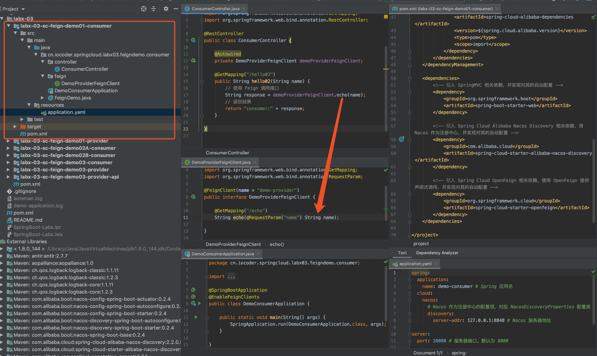

### 2.2.1 引入依赖

在 [`pom.xml`](https://github.com/YunaiV/SpringBoot-Labs/blob/master/labx-03-spring-cloud-feign/labx-03-sc-feign-demo01-consumer/pom.xml) 文件中，主要引入 Spring Cloud **Nacos** Discovery + Spring Cloud Netflix **Ribbon** + Spring Cloud **OpenFeign** 相关依赖。代码如下：


```
<?xml version="1.0" encoding="UTF-8"?>
<project xmlns="http://maven.apache.org/POM/4.0.0"
         xmlns:xsi="http://www.w3.org/2001/XMLSchema-instance"
         xsi:schemaLocation="http://maven.apache.org/POM/4.0.0 http://maven.apache.org/xsd/maven-4.0.0.xsd">
    <parent>
        <artifactId>labx-01</artifactId>
        <groupId>cn.iocoder.springboot.labs</groupId>
        <version>1.0-SNAPSHOT</version>
    </parent>
    <modelVersion>4.0.0</modelVersion>

    <artifactId>labx-03-sc-feign-demo01-consumer</artifactId>

    <properties>
        <spring.boot.version>2.2.4.RELEASE</spring.boot.version>
        <spring.cloud.version>Hoxton.SR1</spring.cloud.version>
        <spring.cloud.alibaba.version>2.2.0.RELEASE</spring.cloud.alibaba.version>
    </properties>

    <!--
        引入 Spring Boot、Spring Cloud、Spring Cloud Alibaba 三者 BOM 文件，进行依赖版本的管理，防止不兼容。
        在 https://dwz.cn/mcLIfNKt 文章中，Spring Cloud Alibaba 开发团队推荐了三者的依赖关系
     -->
    <dependencyManagement>
        <dependencies>
            <dependency>
                <groupId>org.springframework.boot</groupId>
                <artifactId>spring-boot-starter-parent</artifactId>
                <version>${spring.boot.version}</version>
                <type>pom</type>
                <scope>import</scope>
            </dependency>
            <dependency>
                <groupId>org.springframework.cloud</groupId>
                <artifactId>spring-cloud-dependencies</artifactId>
                <version>${spring.cloud.version}</version>
                <type>pom</type>
                <scope>import</scope>
            </dependency>
            <dependency>
                <groupId>com.alibaba.cloud</groupId>
                <artifactId>spring-cloud-alibaba-dependencies</artifactId>
                <version>${spring.cloud.alibaba.version}</version>
                <type>pom</type>
                <scope>import</scope>
            </dependency>
        </dependencies>
    </dependencyManagement>

    <dependencies>
        <!-- 引入 SpringMVC 相关依赖，并实现对其的自动配置 -->
        <dependency>
            <groupId>org.springframework.boot</groupId>
            <artifactId>spring-boot-starter-web</artifactId>
        </dependency>

        <!-- 引入 Spring Cloud Alibaba Nacos Discovery 相关依赖，将 Nacos 作为注册中心，并实现对其的自动配置 -->
        <dependency>
            <groupId>com.alibaba.cloud</groupId>
            <artifactId>spring-cloud-starter-alibaba-nacos-discovery</artifactId>
        </dependency>

        <!-- 引入 Spring Cloud OpenFeign 相关依赖，使用 OpenFeign 提供声明式调用，并实现对其的自动配置 -->
        <dependency>
            <groupId>org.springframework.cloud</groupId>
            <artifactId>spring-cloud-starter-openfeign</artifactId>
        </dependency>
    </dependencies>

</project>
```


这里我们没有主动引入 [`spring-cloud-netflix-ribbon`](https://mvnrepository.com/artifact/org.springframework.cloud/spring-cloud-netflix-ribbon) 依赖，因为 `spring-cloud-starter-alibaba-nacos-discovery` 和 `spring-cloud-starter-openfefign` 默认都引入了它。如下图所示：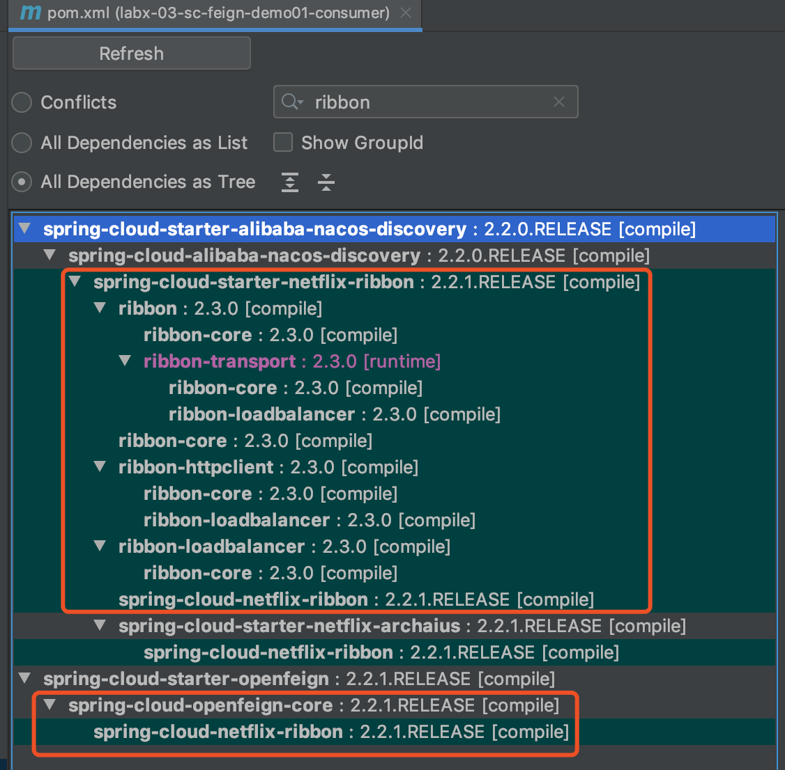

### 2.2.2 配置文件

创建 [`application.yaml`](https://github.com/YunaiV/SpringBoot-Labs/blob/master/labx-03-spring-cloud-feign/labx-03-sc-feign-demo01-consumer/src/main/resources/application.yaml) 配置类，添加相应配置项。配置如下：


```
spring:
  application:
    name: demo-consumer # Spring 应用名
  cloud:
    nacos:
      # Nacos 作为注册中心的配置项，对应 NacosDiscoveryProperties 配置类
      discovery:
        server-addr: 127.0.0.1:8848 # Nacos 服务器地址

server:
  port: 28080 # 服务器端口。默认为 8080
```


### 2.2.3 DemoProviderFeignClient

创建 [DemoProviderFeignClient](https://github.com/YunaiV/SpringBoot-Labs/blob/master/labx-03-spring-cloud-feign/labx-03-sc-feign-demo01-consumer/src/main/java/cn/iocoder/springcloud/labx03/feigndemo/consumer/feign/DemoProviderFeignClient.java) 接口，实现对服务 `demo-provider` 声明式调用。代码如下：


```
@FeignClient(name = "demo-provider")
public interface DemoProviderFeignClient {

    @GetMapping("/echo")
    String echo(@RequestParam("name") String name);

}
```


① [`@FeignClient`](https://github.com/spring-cloud/spring-cloud-openfeign/blob/master/spring-cloud-openfeign-core/src/main/java/org/springframework/cloud/openfeign/FeignClient.java) 注解，声明 Feign 客户端。其中 `name` 属性，为 **Feign 客户端**的名字，也为 **Ribbon 客户端**的名字，也为注册中心的**服务**的名字。

② 在 `#echo(name)` 方法上，添加 SpringMVC 注解，实现对 `GET /demo` 接口的声明式调用。

### 2.2.4 ConsumerController

创建 [ConsumerController](https://github.com/YunaiV/SpringBoot-Labs/blob/master/labx-03-spring-cloud-feign/labx-03-sc-feign-demo01-consumer/src/main/java/cn/iocoder/springcloud/labx03/feigndemo/consumer/controller/ConsumerController.java) 类，提供一个通过 Feign 调用服务提供者的 HTTP 接口。代码如下：


```
@RestController
public class ConsumerController {

    @Autowired
    private DemoProviderFeignClient demoProviderFeignClient;

    @GetMapping("/hello02")
    public String hello02(String name) {
        // 使用 Feign 调用接口
        String response = demoProviderFeignClient.echo(name);
        // 返回结果
        return "consumer:" + response;
    }

}
```


### 2.2.5 DemoConsumerApplication

创建 [DemoConsumerApplication](https://github.com/YunaiV/SpringBoot-Labs/blob/master/labx-03-spring-cloud-feign/labx-03-sc-feign-demo01-consumer/src/main/java/cn/iocoder/springcloud/labx03/feigndemo/consumer/DemoConsumerApplication.java) 类，创建应用启动类。代码如下：


```
@SpringBootApplication
@EnableFeignClients
public class DemoConsumerApplication {

    public static void main(String[] args) {
        SpringApplication.run(DemoConsumerApplication.class, args);
    }

}
```


[`@EnableFeignClients`](https://github.com/spring-cloud/spring-cloud-openfeign/blob/master/spring-cloud-openfeign-core/src/main/java/org/springframework/cloud/openfeign/EnableFeignClients.java) 注解，添加在类上，声明开启 Feign 客户端的功能。

## 2.3 简单测试

① 通过 DemoProviderApplication 启动 2 次，启动服务提供者的 2 个实例。因为 IDEA 默认同一个程序只允许启动 1 次，所以我们需要配置 DemoProviderApplication 为 `Allow parallel run`。如下图所示：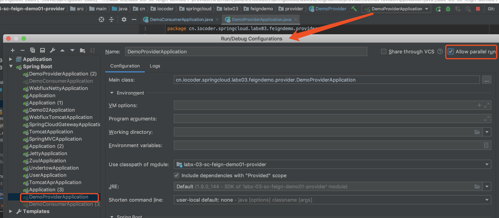

② 通过 DemoConsumerApplication 启动服务消费者。

访问服务**消费者**的 http://127.0.0.1:28080/hello02?name=yudaoyuanma 接口 2 次，返回结果如下：


```
consumer:10107-provider:123
consumer:13729-provider:123
```


- 使用 Feign 声明式调用服务 `demo-provider` 成功
- 使用 Ribbon 负载均衡成功
- 从注册中心 Nacos 加载服务 `demo-provider` 的服务实例成功

# 3. 自定义 Feign 配置

本小节，我们来学习如何对 Feign 进行自定义配置。例如说，自定义 Feign 的日志配置，将 Feign 的请求信息打印出来，方便排查问题。

在自定义 Feign 配置的时候，会有**全局**和**客户端**两种级别。相比来说，**客户端**级别是更细粒度的配置。针对每个服务，Spring Cloud OpenFeign 会创建一个 Feign 客户端，并且使用**服务名**作为 **Feign 客户端的名字**。

实现 Feign 自定义配置，可以通过**配置文件**和 **Spring JavaConfig** 两种方式。

下面，让我们来搭建下自定义 Feign 配置的示例。注意，本小节的所有示例，都是从[「2.2 搭建服务消费者」](https://www.iocoder.cn/Spring-Cloud/Feign/?github#)小节的 [`labx-01-sca-nacos-discovery-demo01-consumer`](https://github.com/YunaiV/SpringBoot-Labs/blob/master/labx-03-spring-cloud-feign/labx-03-sc-feign-demo01-consumer/) 项目，复制出一个项目，然后在将其配置，自定义 Feign 的日志配置。

在 Feign 中，定义了四种[日志级别](https://github.com/OpenFeign/feign/blob/master/core/src/main/java/feign/Logger.java#L128-L148)：

- `NONE`：不打印日志
- `BASIC`：只打印基本信息，包括请求方法、请求地址、响应状态码、请求时长
- `HEADERS`：在 `BASIC` 基础信息的基础之上，增加请求头、响应头
- `FULL`：打印完整信息，包括请求和响应的所有信息。

## 3.1 配置文件方式

> 示例代码对应仓库：
>
> - 服务提供者：[`labx-03-sc-feign-demo01-provider`](https://github.com/YunaiV/SpringBoot-Labs/blob/master/labx-03-spring-cloud-feign/labx-03-sc-feign-demo01-provider)
> - 服务消费者：[`labx-03-sc-feign-demo02A-consumer`](https://github.com/YunaiV/SpringBoot-Labs/blob/master/labx-03-spring-cloud-feign/labx-03-sc-feign-demo02A-consumer/)

本小节，我们使用**配置文件**的方式，实现 Feign **全局**和**客户端**两种级别的自定义配置。

### 3.1.1 复制项目

复制出 [`labx-03-sc-feign-demo02A-consumer`](https://github.com/YunaiV/SpringBoot-Labs/blob/master/labx-03-spring-cloud-feign/labx-03-sc-feign-demo02A-consumer/) 项目，进行修改。

### 3.1.2 配置文件方式

修改 [`application.yaml`](https://github.com/YunaiV/SpringBoot-Labs/blob/master/labx-03-spring-cloud-feign/labx-03-sc-feign-demo02A-consumer/src/main/resources/application.yaml) 配置文件，额外添加如下配置：


```
logging:
  level:
    cn.iocoder.springcloud.labx03.feigndemo.consumer.feign: DEBUG

feign:
  # Feign 客户端配置，对应 FeignClientProperties 配置属性类
  client:
    # config 配置项是 Map 类型。key 为 Feign 客户端的名字，value 为 FeignClientConfiguration 对象
    config:
      # 全局级别配置
      default:
        logger-level: BASIC
      # 客户端级别配置
      demo-provider:
        logger-level: FULL
```


① 在 `logging.level` 配置项下，添加自定义 Feign 接口所在包的日志级别为 `DEBUG`。Feign 定义的四种日志级别，针对的是日志内容的级别。最终打印日志时，Feign 是调用日志组件的 `DEBUG` 级别打印日志，所以这里需要设置为 `DEBUG` 级别。

② 在 `feign.client` 配置下，设置 Feign 客户端的配置，对应 [FeignClientProperties](https://github.com/spring-cloud/spring-cloud-openfeign/blob/master/spring-cloud-openfeign-core/src/main/java/org/springframework/cloud/openfeign/FeignClientProperties.java) 配置属性类。其中 `config` 配置项，可以设置每个 Feign 客户端的配置，并且 *key* 为 Feign 客户端的名字，*value* 为 [FeignClientConfiguration](https://github.com/spring-cloud/spring-cloud-openfeign/blob/master/spring-cloud-openfeign-core/src/main/java/org/springframework/cloud/openfeign/FeignClientProperties.java#L90-L238) 对象。

- `default` 为特殊的 *key*，用于**全局级别**的配置。
- `logger-level` 配置项，设置 Feign 的日志级别。

总结来说，这里配置名字为 `demo-provider` 的 Feign 客户端的日志级别为 `FULL`，全局级别的 Feign 客户端的日志级别为 `BASIC`。

### 3.1.3 简单测试

① 通过[「2.1 搭建服务提供者」](https://www.iocoder.cn/Spring-Cloud/Feign/?github#)小节的 DemoProviderApplication 启动，启动服务提供者的实例。

② 通过 DemoConsumerApplication 启动服务消费者。

访问服务**消费者**的 http://127.0.0.1:28080/hello02?name=yudaoyuanma 接口，可以看到 IDEA 控制台输出如下 Feign 请求日志：


```
2020-02-10 19:37:24.603 DEBUG 3004 --- [io-28080-exec-4] c.i.s.l.f.c.f.DemoProviderFeignClient    : [DemoProviderFeignClient#echo] ---> GET http://demo-provider/echo?name=yudaoyuanma HTTP/1.1
2020-02-10 19:37:24.603 DEBUG 3004 --- [io-28080-exec-4] c.i.s.l.f.c.f.DemoProviderFeignClient    : [DemoProviderFeignClient#echo] ---> END HTTP (0-byte body)
2020-02-10 19:37:24.712 DEBUG 3004 --- [io-28080-exec-4] c.i.s.l.f.c.f.DemoProviderFeignClient    : [DemoProviderFeignClient#echo] <--- HTTP/1.1 200 (109ms)
2020-02-10 19:37:24.712 DEBUG 3004 --- [io-28080-exec-4] c.i.s.l.f.c.f.DemoProviderFeignClient    : [DemoProviderFeignClient#echo] connection: keep-alive
2020-02-10 19:37:24.713 DEBUG 3004 --- [io-28080-exec-4] c.i.s.l.f.c.f.DemoProviderFeignClient    : [DemoProviderFeignClient#echo] content-length: 26
2020-02-10 19:37:24.713 DEBUG 3004 --- [io-28080-exec-4] c.i.s.l.f.c.f.DemoProviderFeignClient    : [DemoProviderFeignClient#echo] content-type: text/plain;charset=UTF-8
2020-02-10 19:37:24.713 DEBUG 3004 --- [io-28080-exec-4] c.i.s.l.f.c.f.DemoProviderFeignClient    : [DemoProviderFeignClient#echo] date: Mon, 10 Feb 2020 11:37:24 GMT
2020-02-10 19:37:24.713 DEBUG 3004 --- [io-28080-exec-4] c.i.s.l.f.c.f.DemoProviderFeignClient    : [DemoProviderFeignClient#echo] keep-alive: timeout=60
2020-02-10 19:37:24.713 DEBUG 3004 --- [io-28080-exec-4] c.i.s.l.f.c.f.DemoProviderFeignClient    : [DemoProviderFeignClient#echo] 
2020-02-10 19:37:24.713 DEBUG 3004 --- [io-28080-exec-4] c.i.s.l.f.c.f.DemoProviderFeignClient    : [DemoProviderFeignClient#echo] 14603-provider:yudaoyuanma
2020-02-10 19:37:24.713 DEBUG 3004 --- [io-28080-exec-4] c.i.s.l.f.c.f.DemoProviderFeignClient    : [DemoProviderFeignClient#echo] <--- END HTTP (26-byte body)
```


- 从日志中也可以看出 Feign 是调用日志组件的 `DEBUG` 级别打印日志。

如果胖友想要测试 Feign 全局级别的自定义配置的效果，可以注释掉 `feign.client.config.demo-provider` 配置项。

### 3.1.4 更多配置项

通过 [FeignClientConfiguration](https://github.com/spring-cloud/spring-cloud-openfeign/blob/master/spring-cloud-openfeign-core/src/main/java/org/springframework/cloud/openfeign/FeignClientProperties.java#L90-L238) 配置属性类，我们可以看到配置文件所支持的 FeignClient 的所有配置项。代码如下：


```
// Feign 日志级别。默认为 NONE
private Logger.Level loggerLevel;
// 请求的连接超时时长，单位：毫秒。默认为 10 * 1000 毫秒
private Integer connectTimeout;
// 请求的读取超时时长，单位：毫秒。默认为 60 * 1000 毫秒
private Integer readTimeout;
// 重试策略。默认为不重试
private Class<Retryer> retryer;
// 错误解码器
private Class<ErrorDecoder> errorDecoder;
// 请求拦截器
private List<Class<RequestInterceptor>> requestInterceptors;
// 是否对响应状态码为 404 时，进行解码。默认为 false 
private Boolean decode404;
// 解码器。
// 为空时，默认创建 SpringDecoder Bean
private Class<Decoder> decoder;
// 解码器。默认为 SpringEncoder
// 为空时，默认创建 SpringEncoder Bean
private Class<Encoder> encoder;
// 契约。
// 为空时，默认创建 SpringMvcContract Bean，提供对 SpringMVC 注解的支持
private Class<Contract> contract;
```


## 3.2 Spring JavaConfig 方式

> 示例代码对应仓库：
>
> - 服务提供者：[`labx-03-sc-feign-demo01-provider`](https://github.com/YunaiV/SpringBoot-Labs/blob/master/labx-03-spring-cloud-feign/labx-03-sc-feign-demo01-provider)
> - 服务消费者：[`labx-03-sc-feign-demo02B-consumer`](https://github.com/YunaiV/SpringBoot-Labs/blob/master/labx-03-spring-cloud-feign/labx-03-sc-feign-demo02B-consumer/)

本小节，我们使用 **Spring JavaConfig** 的方式，实现 Feign **全局**和**客户端**两种级别的自定义配置。

### 3.2.1 复制项目

复制出 [`labx-03-sc-feign-demo02B-consumer`](https://github.com/YunaiV/SpringBoot-Labs/blob/master/labx-03-spring-cloud-feign/labx-03-sc-feign-demo02B-consumer/) 项目，进行修改。最终项目如下图所示：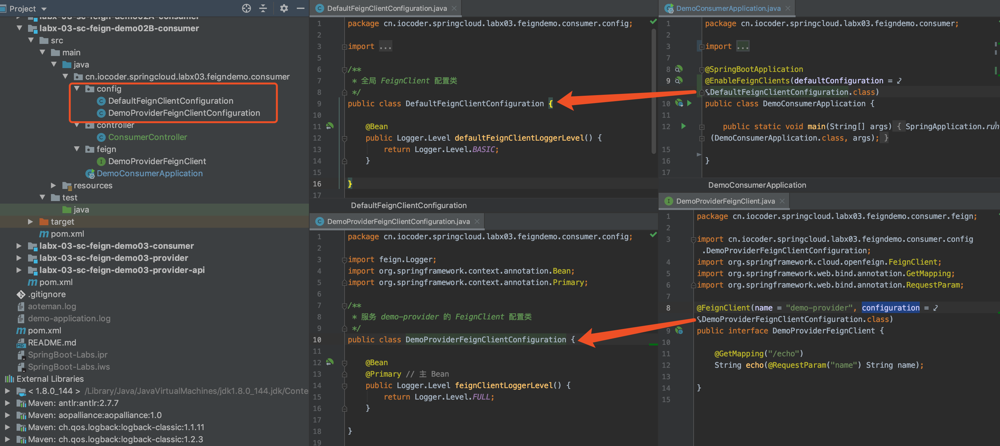

### 3.2.2 FeignClient 配置类

创建 [DefaultFeignClientConfiguration](https://github.com/YunaiV/SpringBoot-Labs/blob/master/labx-03-spring-cloud-feign/labx-03-sc-feign-demo02B-consumer/src/main/java/cn/iocoder/springcloud/labx03/feigndemo/consumer/config/DefaultFeignClientConfiguration.java)、[DemoProviderFeignClientConfiguration](https://github.com/YunaiV/SpringBoot-Labs/blob/master/labx-03-spring-cloud-feign/labx-03-sc-feign-demo02B-consumer/src/main/java/cn/iocoder/springcloud/labx03/feigndemo/consumer/config/DemoProviderFeignClientConfiguration.java) 配置类，FeignClient 配置类。代码如下：


```
// DefaultFeignClientConfiguration.java
/**
 * 全局 FeignClient 配置类
 */
public class DefaultFeignClientConfiguration {

    @Bean
    public Logger.Level defaultFeignClientLoggerLevel() {
        return Logger.Level.BASIC;
    }

}

// DemoProviderFeignClientConfiguration.java
/**
 * 服务 demo-provider 的 FeignClient 配置类
 */
public class DemoProviderFeignClientConfiguration {

    @Bean
    @Primary // 主 Bean
    public Logger.Level feignClientLoggerLevel() {
        return Logger.Level.FULL;
    }

}
```


① 对于 DefaultFeignClientConfiguration 和 DemoProviderFeignClientConfiguration 两个配置类，我们并**没有添加 `@Configuration` 注解**。

因为，Spring Boot 项目默认扫描 DemoConsumerApplication **所在包以及子包**下的所有 Bean 们。而 `@Configuration` 注解也是一种 Bean，也会被扫描到。

如果添加 `@Configuration` 注解到 DefaultFeignClientConfiguration 和 DemoProviderFeignClientConfiguration 上，将会被 Spring Boot 所扫描到，导致整个项目的 Feign 客户端都使用相同的 Feign 配置，就**无法到达 Feign 客户端级别的自定义配置的目的**。

因此，我们没有给 DefaultFeignClientConfiguration 和 DemoProviderFeignClientConfiguration 添加 `@Configuration` 注解。

> 友情提示，可以不看。
>
> 当然，如果胖友想要添加 `@Configuration` 注解到 DefaultFeignClientConfiguration 和 DemoProviderFeignClientConfiguration 上的话，还有一个**不是很推荐**的方案，将 DefaultFeignClientConfiguration 和 DemoProviderFeignClientConfiguration 移到和 DemoConsumerApplication 不同包中，避免被 Spring Boot 所扫描到。
>
> 例如说，在根路径下创建 `feign` 包，并将 DefaultFeignClientConfiguration 和 DemoProviderFeignClientConfiguration 放入其中。

② 为了避免多个 Feign 客户端级别的配置类创建的 Bean 之间互相冲突，Spring Cloud OpenFeign 通过 [FeignContext](https://github.com/spring-cloud/spring-cloud-openfeign/blob/master/spring-cloud-openfeign-core/src/main/java/org/springframework/cloud/openfeign/FeignContext.java) 类，**为每一个 Feign 客户端创建一个 Spring 子上下文**。在 Spring Cloud OpenFeign 的设计中，Spring 的上下文设计特别有趣，胖友可以先暂时记住：

- **全局级别**的 FeignClient 配置类是在 Spring **父上下文**生效
- **客户端级别**的 FeignClient 配置类在 Spring **子上下文**生效。

不过这里要注意，因为 DefaultFeignClientConfiguration 和 DemoProviderFeignClientConfiguration 都创建了 Logger.Level Bean，而 DefaultFeignClientConfiguration 是在 Spring **父上下文**生效，会和 DemoProviderFeignClientConfiguration 所在的 Spring **子上下文**共享。

这样就导致从 Spring 获取 Logger.Level Bean 时，存在**两个**而不知道选择哪一个。因此，我们声明 DefaultFeignClientConfiguration 创建的 Logger.Level Bean 为 `@Primary`，优先使用它。

> 友情提示：这里会有一点点绕，胖友好好理解哈~

### 3.2.3 客户端级别的自定义配置

通过 `@FeignClient` 注解的 `configuration` 属性，我们可以设置**指定** FeignClient 使用的配置类，即 **Feign 客户端级别的自定义配置**。因此我们修改 [DemoProviderFeignClient](https://github.com/YunaiV/SpringBoot-Labs/blob/master/labx-03-spring-cloud-feign/labx-03-sc-feign-demo02B-consumer/src/main/java/cn/iocoder/springcloud/labx03/feigndemo/consumer/feign/DemoProviderFeignClient.java) 代码如下图所示：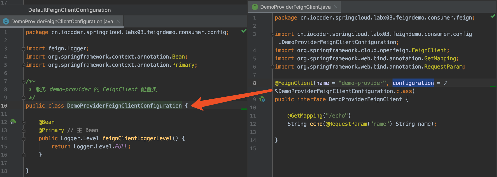

### 3.2.4 全局级别的自定义配置

通过 `@EnableFeignClients` 注解的 `defaultConfiguration` 属性，我们可以设置**默认** FeignClient 使用的配置类，即 **Feign 全局级别的自定义配置**。因此我们修改 [DemoConsumerApplication](https://github.com/YunaiV/SpringBoot-Labs/blob/master/labx-03-spring-cloud-feign/labx-03-sc-feign-demo02B-consumer/src/main/java/cn/iocoder/springcloud/labx03/feigndemo/consumer/DemoConsumerApplication.java) 代码如下图所示：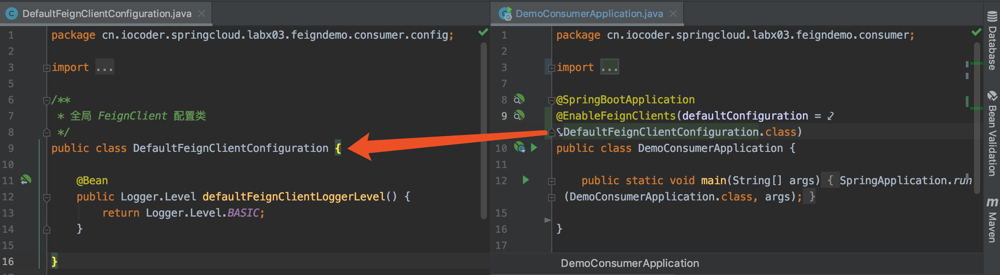

### 3.2.5 简单测试

① 通过[「2.1 搭建服务提供者」](https://www.iocoder.cn/Spring-Cloud/Feign/?github#)小节的 DemoProviderApplication 启动服务提供者。

② 通过 DemoConsumerApplication 启动服务消费者。

访问服务**消费者**的 http://127.0.0.1:28080/hello02?name=yudaoyuanma 接口，可以看到 IDEA 控制台输出如下 Feign 请求日志：


```
2020-02-10 23:28:50.007 DEBUG 13774 --- [io-28080-exec-6] c.i.s.l.f.c.f.DemoProviderFeignClient    : [DemoProviderFeignClient#echo] ---> GET http://demo-provider/echo?name=yudaoyuanma HTTP/1.1
2020-02-10 23:28:50.007 DEBUG 13774 --- [io-28080-exec-6] c.i.s.l.f.c.f.DemoProviderFeignClient    : [DemoProviderFeignClient#echo] ---> END HTTP (0-byte body)
2020-02-10 23:28:50.114 DEBUG 13774 --- [io-28080-exec-6] c.i.s.l.f.c.f.DemoProviderFeignClient    : [DemoProviderFeignClient#echo] <--- HTTP/1.1 200 (106ms)
2020-02-10 23:28:50.114 DEBUG 13774 --- [io-28080-exec-6] c.i.s.l.f.c.f.DemoProviderFeignClient    : [DemoProviderFeignClient#echo] connection: keep-alive
2020-02-10 23:28:50.114 DEBUG 13774 --- [io-28080-exec-6] c.i.s.l.f.c.f.DemoProviderFeignClient    : [DemoProviderFeignClient#echo] content-length: 26
2020-02-10 23:28:50.114 DEBUG 13774 --- [io-28080-exec-6] c.i.s.l.f.c.f.DemoProviderFeignClient    : [DemoProviderFeignClient#echo] content-type: text/plain;charset=UTF-8
2020-02-10 23:28:50.114 DEBUG 13774 --- [io-28080-exec-6] c.i.s.l.f.c.f.DemoProviderFeignClient    : [DemoProviderFeignClient#echo] date: Mon, 10 Feb 2020 15:28:50 GMT
2020-02-10 23:28:50.114 DEBUG 13774 --- [io-28080-exec-6] c.i.s.l.f.c.f.DemoProviderFeignClient    : [DemoProviderFeignClient#echo] keep-alive: timeout=60
2020-02-10 23:28:50.114 DEBUG 13774 --- [io-28080-exec-6] c.i.s.l.f.c.f.DemoProviderFeignClient    : [DemoProviderFeignClient#echo] 
2020-02-10 23:28:50.114 DEBUG 13774 --- [io-28080-exec-6] c.i.s.l.f.c.f.DemoProviderFeignClient    : [DemoProviderFeignClient#echo] 14747-provider:yudaoyuanma
2020-02-10 23:28:50.114 DEBUG 13774 --- [io-28080-exec-6] c.i.s.l.f.c.f.DemoProviderFeignClient    : [DemoProviderFeignClient#echo] <--- END HTTP (26-byte body)
```


- 从日志中也可以看出 Feign 是调用日志组件的 `DEBUG` 级别打印日志。

如果胖友想要测试 Feign 全局级别的自定义配置的效果，可以去掉 DemoProviderFeignClient 类上的 `@FeignClient` 注解的 `configuration` 属性。

### 3.2.6 更多配置 Bean

通过 [FeignClientsConfiguration](https://github.com/spring-cloud/spring-cloud-openfeign/blob/master/spring-cloud-openfeign-core/src/main/java/org/springframework/cloud/openfeign/FeignClientsConfiguration.java) 配置类，我们可以看到 Spring JavaConfig 所支持的 FeignClient 的所有 Bean。例如说：


```
// FeignClientsConfiguration.java

@Bean
@ConditionalOnMissingBean
public Contract feignContract(ConversionService feignConversionService) {
	// 创建 SpringMvcContract 类，支持 SpringMVC 注解。
	return new SpringMvcContract(this.parameterProcessors, feignConversionService);
}

// ... 省略其他的
```


因为 FeignClientsConfiguration 创建的 Bean 基本都有 `@ConditionalOnMissingBean` 条件注解，所以我们可以通过 Spring JavaConfig 自定义。

## 3.3 实践建议

- 对于 Feign 自定义配置，推荐使用配置文件的方式，简单方便好管理。在配置文件的方式无法满足的情况下，使用 Spring JavaConfig 的方式作为补充。不过绝大多数场景下，都基本不需要哈~
- 配置文件方式的**优先级**高于 Spring JavaConfig 方式，客户端级别的**优先级**高于全局级别

# 4. 继承特性

> 示例代码对应仓库：
>
> - 服务提供者 API 项目：[`labx-03-sc-feign-demo03-provider-api`](https://github.com/YunaiV/SpringBoot-Labs/tree/master/labx-03-spring-cloud-feign/labx-03-sc-feign-demo03-provider-api)
> - 服务提供者：[`labx-03-sc-feign-demo03-provider`](https://github.com/YunaiV/SpringBoot-Labs/blob/master/labx-03-spring-cloud-feign/labx-03-sc-feign-demo03-provider/)
> - 服务消费者：[`labx-03-sc-feign-demo03-consumer`](https://github.com/YunaiV/SpringBoot-Labs/blob/master/labx-03-spring-cloud-feign/labx-03-sc-feign-demo03-consumer/)

Spring Cloud OpenFeign 提供了 SpringMVC 注解的支持，所以我们可以将服务提供者 Controller 提取出一个**接口**，让服务提供者和消费者共同使用，如下图所示：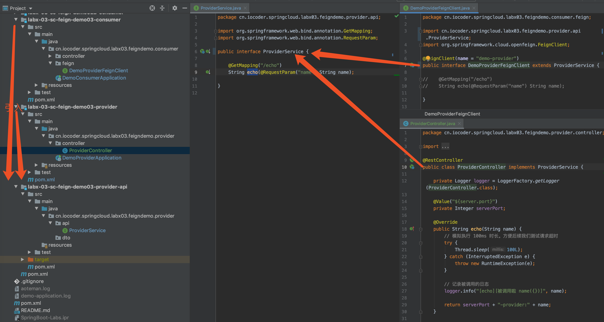

这就是 Spring Cloud OpenFeign 提供的**继承特性**。下面，我们来对[「2. 快速入门」](https://www.iocoder.cn/Spring-Cloud/Feign/?github#)提供的示例代码进行改造。

## 4.1 搭建服务提供者 API 项目

创建 [`labx-03-sc-feign-demo03-provider-api`](https://github.com/YunaiV/SpringBoot-Labs/tree/master/labx-03-spring-cloud-feign/labx-03-sc-feign-demo03-provider-api) 项目，提供服务提供者的 **API 接口**和 **DTO** 类。最终项目如下图所示：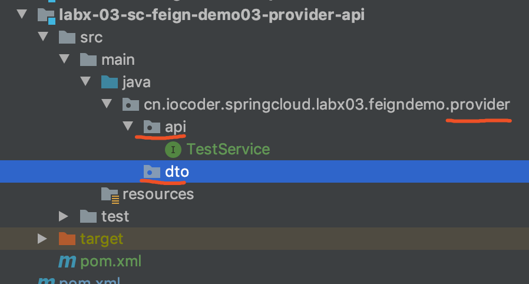

- `api` 包：提供服务提供者的 API 接口。
- `dto` 包：提供数据传输对象 DTO 类。

> 友情提示：不了解 DTO的胖友，可以看看[《浅析 VO、DTO、DO、PO的概念、区别和用处》](http://www.iocoder.cn/Fight/A-brief-analysis-of-the-concepts,-differences-and-USES-of-VO,-DTO,-DO-and-PO/?self)文章。

### 4.1.1 引入依赖

在 [`pom.xml`](https://github.com/YunaiV/SpringBoot-Labs/tree/master/labx-03-spring-cloud-feign/labx-03-sc-feign-demo03-provider-api/pom.xml) 文件中，主要引入 SpringMVC 相关依赖。代码如下：


```
<?xml version="1.0" encoding="UTF-8"?>
<project xmlns="http://maven.apache.org/POM/4.0.0"
         xmlns:xsi="http://www.w3.org/2001/XMLSchema-instance"
         xsi:schemaLocation="http://maven.apache.org/POM/4.0.0 http://maven.apache.org/xsd/maven-4.0.0.xsd">
    <parent>
        <artifactId>labx-01</artifactId>
        <groupId>cn.iocoder.springboot.labs</groupId>
        <version>1.0-SNAPSHOT</version>
    </parent>
    <modelVersion>4.0.0</modelVersion>

    <artifactId>labx-03-sc-feign-demo03-provider-api</artifactId>

    <dependencies>
        <!-- 引入 SpringMVC 依赖 -->
        <dependency>
            <groupId>org.springframework</groupId>
            <artifactId>spring-web</artifactId>
            <version>5.2.3.RELEASE</version>
            <scope>provided</scope> <!-- scope 为 provided 提供级别即可，真正版本的依赖，交给服务提供者和消费者 -->
        </dependency>
    </dependencies>

</project>
```


因为我们需要 SpringMVC 的注解，所以引入 `spring-web` 依赖。

### 4.1.2 TestService

创建 [TestService](https://github.com/YunaiV/SpringBoot-Labs/blob/master/labx-03-spring-cloud-feign/labx-03-sc-feign-demo03-provider-api/src/main/java/cn/iocoder/springcloud/labx03/feigndemo/provider/api/TestService.java) 接口，作为服务 `user-provider` 的 TestController 的 API 接口。代码如下：


```
public interface TestService {

    @GetMapping("/echo")
    String echo(@RequestParam("name") String name);

}
```


## 4.2 搭建服务提供者

本小节，我们将在服务提供者项目中，**引入服务提供者 API 项目**。

### 4.2.1 复制项目

从[「2.1 搭建服务提供者」](https://www.iocoder.cn/Spring-Cloud/Feign/?github#)小节的 [`labx-03-sc-feign-demo01-provider`](https://github.com/YunaiV/SpringBoot-Labs/blob/master/labx-03-spring-cloud-feign/labx-03-sc-feign-demo01-provider) 项目，复制出 [`labx-03-sc-feign-demo03-provider`](https://github.com/YunaiV/SpringBoot-Labs/blob/master/labx-03-spring-cloud-feign/labx-03-sc-feign-demo03-provider/) 项目。然后在其上进行修改，方便搭建~

### 4.2.2 引入依赖

修改 [`pom.xml`](https://github.com/YunaiV/SpringBoot-Labs/blob/master/labx-03-spring-cloud-feign/labx-03-sc-feign-demo03-provider/pom.xml)，**额外**引入服务提供者 API 项目。代码如下：


```
<!-- 引入 SpringMVC 依赖 -->
<dependency>
    <groupId>org.springframework</groupId>
    <artifactId>spring-web</artifactId>
    <version>5.2.3.RELEASE</version>
    <scope>provided</scope> <!-- scope 为 provided 提供级别即可，真正版本的依赖，交给服务提供者和消费者 -->
</dependency>
```


### 4.2.3 ProviderController

修改 [ProviderController](https://github.com/YunaiV/SpringBoot-Labs/blob/master/labx-03-spring-cloud-feign/labx-03-sc-feign-demo03-provider/src/main/java/cn/iocoder/springcloud/labx03/feigndemo/provider/controller/ProviderController.java) 类，实现 TestService 接口。结果如下图所示：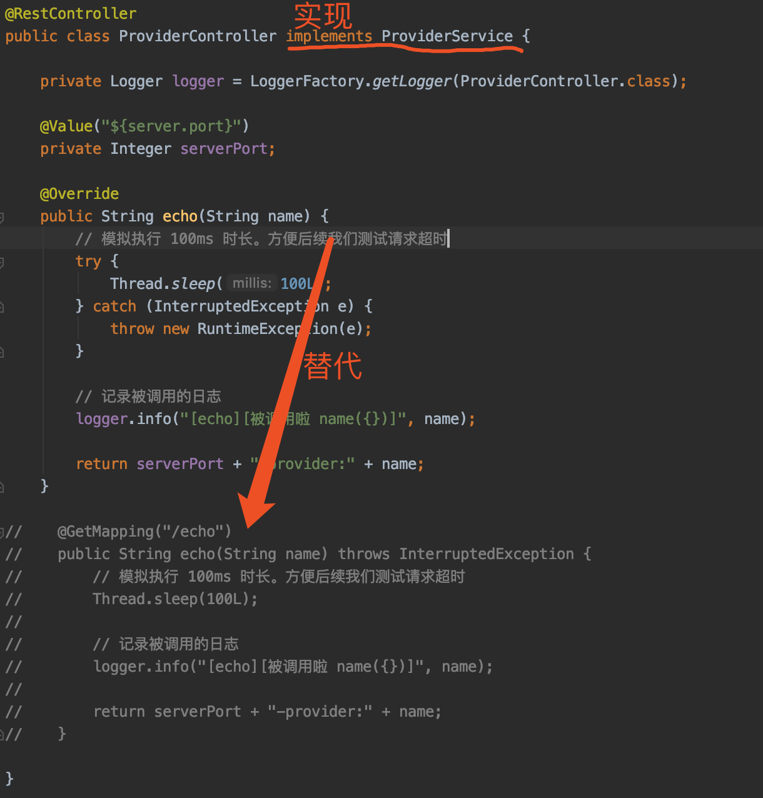

## 4.3 搭建服务消费者

本小节，我们将在服务消费者项目中，**引入服务提供者 API 项目**。

### 4.3.1 复制项目

从[「2.2 搭建服务消费者」](https://www.iocoder.cn/Spring-Cloud/Feign/?github#)小节的 [`labx-03-sc-feign-demo01-consumer`](https://github.com/YunaiV/SpringBoot-Labs/blob/master/labx-03-spring-cloud-feign/labx-03-sc-feign-demo01-consumer) 项目，复制出 [`labx-03-sc-feign-demo03-consumer`](https://github.com/YunaiV/SpringBoot-Labs/blob/master/labx-03-spring-cloud-feign/labx-03-sc-feign-demo03-consumer/) 项目。然后在其上进行修改，方便搭建~

### 4.3.2 引入依赖

修改 [`pom.xml`](https://github.com/YunaiV/SpringBoot-Labs/blob/master/labx-03-spring-cloud-feign/labx-03-sc-feign-demo03-consumer/pom.xml)，**额外**引入服务提供者 API 项目。代码如下：


```
<!-- 引入 SpringMVC 依赖 -->
<dependency>
    <groupId>org.springframework</groupId>
    <artifactId>spring-web</artifactId>
    <version>5.2.3.RELEASE</version>
    <scope>provided</scope> <!-- scope 为 provided 提供级别即可，真正版本的依赖，交给服务提供者和消费者 -->
</dependency>
```


### 4.3.3 DemoProviderFeignClient

修改 [DemoProviderFeignClient](https://github.com/YunaiV/SpringBoot-Labs/blob/master/labx-03-spring-cloud-feign/labx-03-sc-feign-demo03-consumer/src/main/java/cn/iocoder/springcloud/labx03/feigndemo/consumer/feign/DemoProviderFeignClient.java) 接口，继承 TestService 接口。结果如下图所示：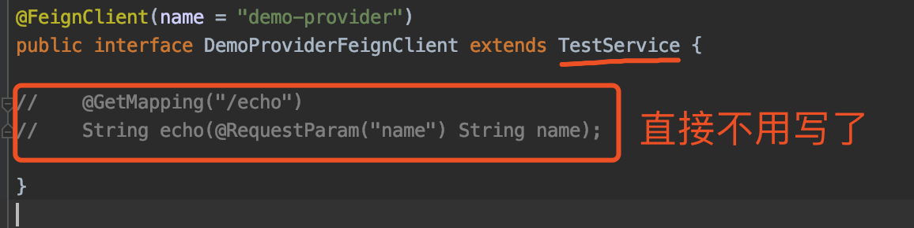

## 4.4 简单测试

① 通过 DemoProviderApplication 启动服务提供者。

② 通过 DemoConsumerApplication 启动服务消费者。

访问服务**消费者**的 http://127.0.0.1:28080/hello02?name=yudaoyuanma 接口，返回结果为 `consumer:16445-provider:yudaoyuanma`。能够调通 HTTP 接口，说明使用继承特性成功。

## 4.5 实践建议

在 Spring Cloud OpenFeign 官方文档有这么一段话：

> FROM [Feign Inheritance Support](https://cloud.spring.io/spring-cloud-openfeign/reference/html/#spring-cloud-feign-inheritance)
>
> It is generally not advisable to share an interface between a server and a client. It introduces tight coupling, and also actually doesn’t work with Spring MVC in its current form (method parameter mapping is not inherited).

意思是**不推荐使用继承特性**，因为通过 Java 接口的共享，导致服务提供者和消费者的**耦合**，而微服务的目的是为了服务提供者和消费者的**解耦**，存在一定的冲突。

不过实际场景下，**蛮多公司采用继承特性**，显而易见的好处，可以方便服务消费者的快速接入，基本无需编写额外的代码。

具体怎么选择，胖友可以自己进行评估，看看使用继承特性的情况下，在享受优点的同时，是否能够接受带来的缺点。

- 艿艿个人意见的话，是**支持采用继承特性**。
- 从 [Dubbo](http://www.iocoder.cn/Spring-Boot/Dubbo/?self) 的使用方式来说，也可以认为它是是**支持采用继承特性**。

# 5. 复杂参数

> 示例代码对应仓库：
>
> - 服务提供者：[`labx-03-sc-feign-demo04-provider`](https://github.com/YunaiV/SpringBoot-Labs/blob/master/labx-03-spring-cloud-feign/labx-03-sc-feign-demo04-provider/)
> - 服务消费者：[`labx-03-sc-feign-demo04-consumer`](https://github.com/YunaiV/SpringBoot-Labs/blob/master/labx-03-spring-cloud-feign/labx-03-sc-feign-demo04-consumer/)

在[「2. 快速入门」](https://www.iocoder.cn/Spring-Cloud/Feign/?github#)小节中，考虑到简单上手 Spring Cloud OpenFeign 的使用，我们只提供了 Feign 请求单个参数的**简单参数**例子。但是实际项目中，我们必然会面临传递多个参数的复杂参数的场景。例如说：


```
GET /demo/?param1=value1&param2=value2

POST /demo {
    param1: value1,
    param2: value2
}
```


针对 `GET` 和 `POST` 类型的请求，Spring Cloud OpenFeign 传递复杂参数有**不同的处理方式**。下面，让我们来搭建下复杂参数的示例。

## 5.1 搭建服务提供者

### 5.1.1 复制项目

从[「2.1 搭建服务提供者」](https://www.iocoder.cn/Spring-Cloud/Feign/?github#)小节的 [`labx-03-sc-feign-demo01-provider`](https://github.com/YunaiV/SpringBoot-Labs/blob/master/labx-03-spring-cloud-feign/labx-03-sc-feign-demo01-provider) 项目，复制出 [`labx-03-sc-feign-demo04-provider`](https://github.com/YunaiV/SpringBoot-Labs/blob/master/labx-03-spring-cloud-feign/labx-03-sc-feign-demo04-provider/) 项目。然后在其上进行修改，方便搭建~

### 5.1.2 DemoDTO

创建 [DemoDTO](https://github.com/YunaiV/SpringBoot-Labs/blob/master/labx-03-spring-cloud-feign/labx-03-sc-feign-demo04-provider/src/main/java/cn/iocoder/springcloud/labx03/feigndemo/provider/dto/DemoDTO.java) 类，示例 DTO 类。代码如此：


```
public class DemoDTO {

    private String username;
    private String password;
    
    // ... 省略 setter、getter 方法
}
```


### 5.1.3 ProviderController

修改 [ProviderController](https://github.com/YunaiV/SpringBoot-Labs/blob/master/labx-03-spring-cloud-feign/labx-03-sc-feign-demo04-provider/src/main/java/cn/iocoder/springcloud/labx03/feigndemo/provider/controller/ProviderController.java) 类，**额外**增加 `GET`、`POST` 类型请求的复杂参数的示例接口。代码如下：


```
@GetMapping("/get_demo")
public DemoDTO getDemo(DemoDTO demoDTO) {
    return demoDTO;
}

@PostMapping("/post_demo")
public DemoDTO postDemo(@RequestBody DemoDTO demoDTO) {
    return demoDTO;
}
```


## 5.2 搭建服务消费者

### 5.2.1 复制项目

从[「2.2 搭建服务消费者」](https://www.iocoder.cn/Spring-Cloud/Feign/?github#)小节的 [`labx-03-sc-feign-demo01-consumer`](https://github.com/YunaiV/SpringBoot-Labs/blob/master/labx-03-spring-cloud-feign/labx-03-sc-feign-demo01-consumer) 项目，复制出 [`labx-03-sc-feign-demo04-consumer`](https://github.com/YunaiV/SpringBoot-Labs/blob/master/labx-03-spring-cloud-feign/labx-03-sc-feign-demo04-consumer/) 项目。然后在其上进行修改，方便搭建~

### 5.2.2 DemoDTO

创建 [DemoDTO](https://github.com/YunaiV/SpringBoot-Labs/blob/master/labx-03-spring-cloud-feign/labx-03-sc-feign-demo04-consumer/src/main/java/cn/iocoder/springcloud/labx03/feigndemo/consumer/dto/DemoDTO.java) 类，示例 DTO 类。代码如此：


```
public class DemoDTO {

    private String username;
    private String password;
    
    // ... 省略 setter、getter 方法
}
```


### 5.2.3 DemoProviderFeignClient

修改 [DemoProviderFeignClient](https://github.com/YunaiV/SpringBoot-Labs/blob/master/labx-03-spring-cloud-feign/labx-03-sc-feign-demo04-consumer/src/main/java/cn/iocoder/springcloud/labx03/feigndemo/consumer/feign/DemoProviderFeignClient.java) 接口，**额外**增加对[「5.1.3 ProviderController」](https://www.iocoder.cn/Spring-Cloud/Feign/?github#)新提供的 HTTP 接口的调用。代码如下：


```
@GetMapping("/get_demo") // GET 方式一，最推荐
DemoDTO getDemo(@SpringQueryMap DemoDTO demoDTO);

@GetMapping("/get_demo") // GET 方式二，相对推荐
DemoDTO getDemo(@RequestParam("username") String username, @RequestParam("password") String password);

@GetMapping("/get_demo") // GET 方式三，不推荐
DemoDTO getDemo(@RequestParam Map<String, Object> params);

@PostMapping("/post_demo") // POST 方式
DemoDTO postDemo(@RequestBody DemoDTO demoDTO);
```


**📚 `GET` 场景**

①【最推荐】方式一，采用 Spring Cloud OpenFeign 提供的 [`@SpringQueryMap`](https://github.com/spring-cloud/spring-cloud-openfeign/blob/master/spring-cloud-openfeign-core/src/main/java/org/springframework/cloud/openfeign/SpringQueryMap.java) 注解，并使用 DemoDTO 对象。

默认情况下，Feign 针对 POJO 类型的参数，即使我们声明为 `GET` 类型的请求，也会自动转换成 `POST` 类型的请求。如果我们去掉 `@SpringQueryMap` 注解，就会报如下异常：


```
feign.FeignException$MethodNotAllowed: status 405 reading DemoProviderFeignClient#getDemo(DemoDTO)
```


- Feign 自动转换成了 `POST /get_demo` 请求，而服务提供者提供的 `/get_demo` 只支持 `GET` 类型，因此返回响应状态码为 405 的错误。

`@SpringQueryMap` 注解的作用，相当于 Feign 的 [`@QueryMap`](https://github.com/OpenFeign/feign/blob/master/core/src/main/java/feign/QueryMap.java) 注解，将 POJO 对象转换成 [QueryString](https://en.wikipedia.org/wiki/Query_string)。

②【较推荐】方式二，采用 SpringMVC 提供的 `@RequestParam` 注解，并将所有参数平铺开。

参数较少的时候，可以采用这种方式。如果参数过多的话，还是采用方式一更优。

③【不推荐】方式三，采用 SpringMVC 提供的 `@RequestParam` 注解，并使用 Map 对象。非常不推荐，因为可读性差，都不知道传递什么参数。

**📚 `POST` 场景**

① 唯一方式，采用 SpringMVC 提供的 `@RequestBody` 注解，并使用 DemoDTO 对象。

## 5.3 简单测试

① 通过 DemoProviderApplication 启动服务提供者。

② 通过 DemoConsumerApplication 启动服务消费者。访问服务**消费者**的如下接口，进行测试：

| 测试               | 访问地址                                                     |
| :----------------- | :----------------------------------------------------------- |
| `GET` 类型的方式一 | http://127.0.0.1:28080/test_get_demo?type=1&username=xxx&password=ooo |
| `GET` 类型的方式二 | http://127.0.0.1:28080/test_get_demo?type=2&username=xxx&password=ooo |
| `GET` 类型的方式三 | http://127.0.0.1:28080/test_get_demo?type=3&username=xxx&password=ooo |
| `POST` 类型的方式  | http://127.0.0.1:28080/test_post_demo?&username=xxx&password=ooo |

## 5.4 拓展知识

| 场景          | 文章                                                         |
| :------------ | :----------------------------------------------------------- |
| 文件上传      | [《Spring Cloud Feign 接口上传文件》](http://www.iocoder.cn/Fight/The-Spring-Cloud-Feign-interface-uploads-files/?self) |
| Form 表单提交 | [《Spring Cloud Feign Post 表单请求》](http://www.iocoder.cn/Fight/Spring-Cloud-Feign-Post-form-request/?self) |

# 6. Feign 单独使用

> 示例代码对应仓库：
>
> - 服务消费者：[`labx-03-sc-feign-demo05-consumer`](https://github.com/YunaiV/SpringBoot-Labs/blob/master/labx-03-spring-cloud-feign/labx-03-sc-feign-demo05-consumer/)

在使用 Spring Cloud 的项目中，我们**大多数**是通过 Feign 调用从 Ribbon 负载均衡选择的服务实例，而 Ribbon 是通过注册中心获取到的服务实例列表。但是有些场景下，可能想要单独使用 Feign 调用，例如说：

- 调用第三方服务，例如说短信云服务、推送云服务
- 调用的虽然是内部服务，但是并没有注册到注册中心，而是使用 Nginx 代理并负载均衡实现高可用

下面，让我们来搭建下 Feign 单独使用的示例。

## 6.1 复制项目

从[「2.2 搭建服务消费者」](https://www.iocoder.cn/Spring-Cloud/Feign/?github#)小节的 [`labx-03-sc-feign-demo01-consumer`](https://github.com/YunaiV/SpringBoot-Labs/blob/master/labx-03-spring-cloud-feign/labx-03-sc-feign-demo01-consumer) 项目，复制出 [`labx-03-sc-feign-demo05-consumer`](https://github.com/YunaiV/SpringBoot-Labs/blob/master/labx-03-spring-cloud-feign/labx-03-sc-feign-demo05-consumer/) 项目。然后在其上进行修改，方便搭建~

## 6.2 DemoProviderFeignClient

修改 [DemoProviderFeignClient](https://github.com/YunaiV/SpringBoot-Labs/blob/master/labx-03-spring-cloud-feign/labx-03-sc-feign-demo05-consumer/src/main/java/cn/iocoder/springcloud/labx03/feigndemo/consumer/feign/DemoProviderFeignClient.java) 接口，改成调用 [http://www.iocoder.cn](http://www.iocoder.cn/)。代码如下：


```
//@FeignClient(name = "demo-provider")
@FeignClient(name = "iocoder", url = "http://www.iocoder.cn") // 注意，保持 name 属性和 url 属性的 host 是一致的。
public interface DemoProviderFeignClient {

//    @GetMapping("/echo")
//    String echo(@RequestParam("name") String name);

    @GetMapping("/") // 请求首页
    String echo(@RequestParam("name") String name);

}
```


将 `@FeignClient` 注解的 `url` 属性设置要**调用的服务的地址**。不过要**注意**，保持 `name` 属性和 `url` 属性的 host 是一致的，不然还是会使用 Ribbon 进行负载均衡。

## 6.3 简单测试

通过 DemoConsumerApplication 启动服务消费者。然后访问服务**消费者**的 http://127.0.0.1:28080/hello02 接口，返回结果如下图表示成功：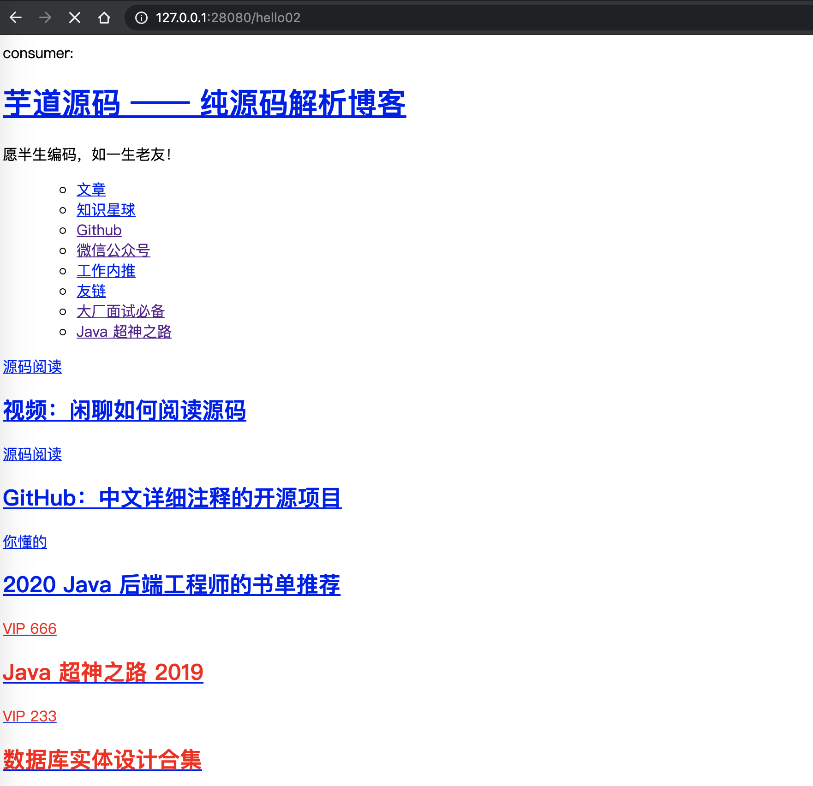

# 7. HTTP 客户端

默认情况下，Feign 通过 JDK 自带的 HttpURLConnection 封装了 [Client.Default](https://github.com/OpenFeign/feign/blob/819b2df8c54d9266abf4cde9b17ab7890ed95cc6/core/src/main/java/feign/Client.java#L58-L232)，实现 HTTP 调用的客户端。因为 HttpURLConnection 缺少对 HTTP 连接池的支持，所以性能较低，在并发到达一定量级后基本会出现。

因此 Feign 提供了另外两个 HTTP 客户端：

- [ApacheHttpClient](https://github.com/OpenFeign/feign/blob/master/httpclient/src/main/java/feign/httpclient/ApacheHttpClient.java)，基于 [Apache HttpClient](https://hc.apache.org/) 封装
- [OkHttpClient](https://github.com/OpenFeign/feign/blob/master/okhttp/src/main/java/feign/okhttp/OkHttpClient.java)，基于 [OkHttp](https://square.github.io/okhttp/) 封装

## 7.1 使用 Apache HttpClient

> 示例代码对应仓库：
>
> - 服务提供者：[`labx-03-sc-feign-demo01-provider`](https://github.com/YunaiV/SpringBoot-Labs/blob/master/labx-03-spring-cloud-feign/labx-03-sc-feign-demo01-provider)
> - 服务消费者：[`labx-03-sc-feign-demo06A-consumer`](https://github.com/YunaiV/SpringBoot-Labs/blob/master/labx-03-spring-cloud-feign/labx-03-sc-feign-demo06A-consumer/)

本小节，我们来搭建下 Apache HttpClient 的使用示例。

### 7.1.1 复制项目

从[「2.2 搭建服务消费者」](https://www.iocoder.cn/Spring-Cloud/Feign/?github#)小节的 [`labx-03-sc-feign-demo01-consumer`](https://github.com/YunaiV/SpringBoot-Labs/blob/master/labx-03-spring-cloud-feign/labx-03-sc-feign-demo01-consumer) 项目，复制出 [`labx-03-sc-feign-demo06A-consumer`](https://github.com/YunaiV/SpringBoot-Labs/blob/master/labx-03-spring-cloud-feign/labx-03-sc-feign-demo06A-consumer/) 项目。然后在其上进行修改，方便搭建~

### 7.1.2 引入依赖

修改 [`pom.xml`](https://github.com/YunaiV/SpringBoot-Labs/blob/master/labx-03-spring-cloud-feign/labx-03-sc-feign-demo06A-consumer/pom.xml)，**额外**引入 `feign-httpclient` 依赖。代码如下：


```
<!-- 引入 Feign Apache HttpClient 依赖 -->
<dependency>
    <groupId>io.github.openfeign</groupId>
    <artifactId>feign-httpclient</artifactId>
</dependency>
```


### 7.1.3 配置文件

修改 [`application.yaml`](https://github.com/YunaiV/SpringBoot-Labs/blob/master/labx-03-spring-cloud-feign/labx-03-sc-feign-demo06A-consumer/src/main/resources/application.yaml) 配置文件，**额外**添加如下配置：


```
feign:
  # Feign Apache HttpClient 配置项，对应 FeignHttpClientProperties 配置属性类
  httpclient:
    enabled: true # 是否开启。默认为 true
    max-connections: 200 # 最大连接数。默认为 200
    max-connections-per-route: 50 # 每个路由的最大连接数。默认为 50。router = host + port
```


通过 `feign.httpclient` 配置项，我们可以开启 Feign Apache HttpClient，并进行自定义配置。在 [FeignHttpClientProperties](https://github.com/spring-cloud/spring-cloud-openfeign/blob/master/spring-cloud-openfeign-core/src/main/java/org/springframework/cloud/openfeign/support/FeignHttpClientProperties.java) 配置属性类中，还有其它配置项，胖友可以简单看看。

不过有一点要注意，虽然说 `feign.httpclient.enable` 默认为 `true` 开启，但是还是需要引入 `feign-httpclient` 依赖，才能创建 ApacheHttpClient 对象。

### 7.1.4 简单测试

① 在 HttpClientFeignLoadBalancedConfiguration 配置类中打个断点，用于确认是否创建了 ApacheHttpClient 对象。

② 使用 Debug 来启动 DemoConsumerApplication 服务消费者。会进入 HttpClientFeignLoadBalancedConfiguration 打的断点，如下图所示：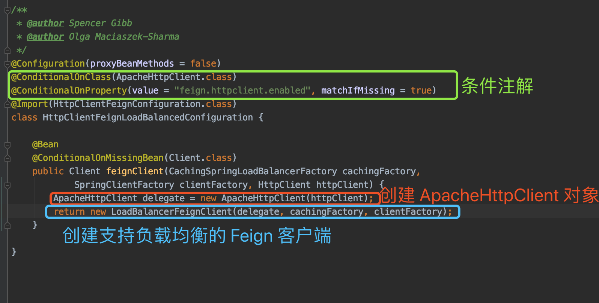

## 7.2 使用 OkHttpClient

> 示例代码对应仓库：
>
> - 服务提供者：[`labx-03-sc-feign-demo01-provider`](https://github.com/YunaiV/SpringBoot-Labs/blob/master/labx-03-spring-cloud-feign/labx-03-sc-feign-demo01-provider)
> - 服务消费者：[`labx-03-sc-feign-demo06B-consumer`](https://github.com/YunaiV/SpringBoot-Labs/blob/master/labx-03-spring-cloud-feign/labx-03-sc-feign-demo06B-consumer/)

本小节，我们来搭建下 OkHttpClient 的使用示例。

### 7.2.1 复制项目

从[「2.2 搭建服务消费者」](https://www.iocoder.cn/Spring-Cloud/Feign/?github#)小节的 [`labx-03-sc-feign-demo01-consumer`](https://github.com/YunaiV/SpringBoot-Labs/blob/master/labx-03-spring-cloud-feign/labx-03-sc-feign-demo01-consumer) 项目，复制出 [`labx-03-sc-feign-demo06B-consumer`](https://github.com/YunaiV/SpringBoot-Labs/blob/master/labx-03-spring-cloud-feign/labx-03-sc-feign-demo06B-consumer/) 项目。然后在其上进行修改，方便搭建~

### 7.2.2 引入依赖

修改 [`pom.xml`](https://github.com/YunaiV/SpringBoot-Labs/blob/master/labx-03-spring-cloud-feign/labx-03-sc-feign-demo06B-consumer/pom.xml)，**额外**引入 `feign-okhttp` 依赖。代码如下：


```
<!-- 引入 Feign Apache HttpClient 依赖 -->
<dependency>
    <groupId>io.github.openfeign</groupId>
    <artifactId>feign-okhttp</artifactId>
</dependency>
```


### 7.2.3 配置文件

修改 [`application.yaml`](https://github.com/YunaiV/SpringBoot-Labs/blob/master/labx-03-spring-cloud-feign/labx-03-sc-feign-demo06B-consumer/src/main/resources/application.yaml) 配置文件，**额外**添加如下配置：


```
feign:
  httpclient:
    enabled: false # 是否开启。默认为 true
  okhttp:
    enabled: true # 是否开启。默认为 false
```


通过设置 `feign.okhttp.enabled` 配置项为 `true`，我们可以开启 Feign OkHttp。目前暂无其它 `feign.okhttp` 配置项。

另外，因为 `feign.httpclient.enabled` 配置项默认为 `true`，所以需要手动设置成 `false`，避免使用了 Feign Apache HttpClient。

### 7.2.4 简单测试

① 在 OkHttpFeignLoadBalancedConfiguration 配置类中打个断点，用于确认是否创建了 ApacheHttpClient 对象。

② 使用 Debug 来启动 DemoConsumerApplication 服务消费者。会进入 OkHttpFeignLoadBalancedConfiguration 打的断点，如下图所示：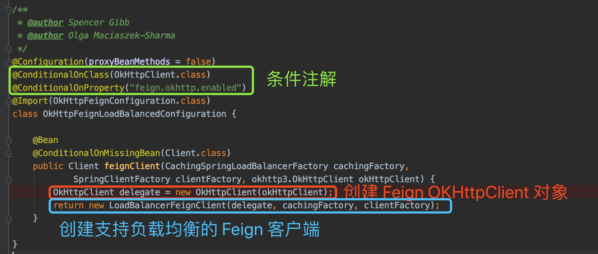

## 7.3 实践建议

OkHttp 和 Apache HttpClient 在性能方面是基本**接近**的，有资料说 OkHttp 好一些，也有资料说 HttpClient 好一些。艿艿建议的话，按照自己对哪一个更熟悉一点，就选择哪一个。

这里有一篇两者对比的文章[《HTTP 客户端连接，选择 HttpClient 还是OkHttp？》](http://www.iocoder.cn/sFight/HTTP-client-connection-HttpClient-or-OkHttp/?self)，感兴趣的胖友可以阅读一波。

# 8. 请求重试

> 示例代码对应仓库：
>
> - 服务提供者：[`labx-03-sc-feign-demo01-provider`](https://github.com/YunaiV/SpringBoot-Labs/blob/master/labx-03-spring-cloud-feign/labx-03-sc-feign-demo01-provider)
> - 服务消费者：[`labx-03-sc-feign-demo07-consumer`](https://github.com/YunaiV/SpringBoot-Labs/blob/master/labx-03-spring-cloud-feign/labx-03-sc-feign-demo07-consumer/)

Feign 和 Ribbon 都有请求重试的功能，两者都启用该功能的话，会产生冲突的问题。因此，有且只能启动一个的重试。目前比较推荐的是使用 Ribbon 来提供重试，如下是来自 Spring Cloud 开发者的说法：

> FROM https://github.com/spring-cloud/spring-cloud-netflix/issues/467
>
> 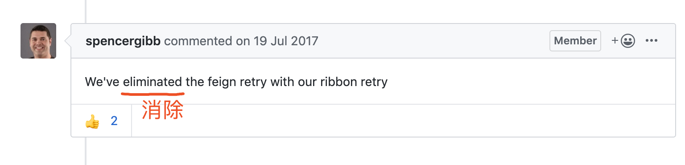

在 Spring Cloud OpenFeign 中，默认创建的是 [NEVER_RETRY](https://github.com/OpenFeign/feign/blob/master/core/src/main/java/feign/Retryer.java#L99-L113) **不进行重试**。如此，我们**只需要配置 Ribbon 的重试**功能即可。

下面，让我们来搭建下 Feign + Ribbon 请求重试的使用示例。

## 8.1 复制项目

从[「2.2 搭建服务消费者」](https://www.iocoder.cn/Spring-Cloud/Feign/?github#)小节的 [`labx-03-sc-feign-demo01-consumer`](https://github.com/YunaiV/SpringBoot-Labs/blob/master/labx-03-spring-cloud-feign/labx-03-sc-feign-demo01-consumer) 项目，复制出 [`labx-03-sc-feign-demo07-consumer`](https://github.com/YunaiV/SpringBoot-Labs/blob/master/labx-03-spring-cloud-feign/labx-03-sc-feign-demo07-consumer/) 项目。然后在其上进行修改，方便搭建~

## 8.2 配置文件

修改 [`application.yaml`](https://github.com/YunaiV/SpringBoot-Labs/blob/master/labx-03-spring-cloud-feign/labx-03-sc-feign-demo07-consumer/src/main/resources/application.yaml) 配置文件，**额外**添加如下配置：


```
ribbon:
  ConnectTimeout: 1000 # 请求的连接超时时间，单位：毫秒。默认为 1000
  ReadTimeout: 1 # 请求的读取超时时间，单位：毫秒。默认为 1000
  OkToRetryOnAllOperations: true # 是否对所有操作都进行重试，默认为 false。
  MaxAutoRetries: 0 # 对当前服务的重试次数，默认为 0 次。
  MaxAutoRetriesNextServer: 1 # 重新选择服务实例的次数，默认为 1 次。注意，不包含第 1 次哈。
```


关于每个配置项的解释，胖友可以阅读[《芋道 Spring Cloud Netflix 负载均衡 Ribbon 入门》](http://www.iocoder.cn/Spring-Cloud-Netflix/Ribbon/?self)的[「9. 请求重试」](https://www.iocoder.cn/Spring-Cloud/Feign/?github#)小节。

这里我们设置 `ribbon.ReadTimeout` 配置项为 1 毫秒，方便模拟请求超时后进行请求重试。

## 8.3 简单测试

① 通过[「2.1 搭建服务提供者」](https://www.iocoder.cn/Spring-Cloud/Feign/?github#)小节的 DemoProviderApplication 启动 2 次，启动服务提供者的 2 个实例。

② 通过 DemoConsumerApplication 启动服务消费者。

访问服务**消费者**的 http://127.0.0.1:28080/hello02?name=yudaoyuanma 接口，返回结果如下：


```
There was an unexpected error (type=Internal Server Error, status=500).
Read timed out executing GET http://demo-provider/echo?name=yudaoyuanma
```


- 符合预期，多次重试后依然失败。

打开 DemoProviderApplication 控制台，可以看到两个服务都被调用的示例：


```
# demo-provider 实例 1
2020-02-15 17:05:43.593  INFO 83451 --- [io-19403-exec-3] c.i.s.l.f.p.c.ProviderController         : [echo][被调用啦 name(yudaoyuanma)]

# demo-provider 实例 2
2020-02-15 17:05:43.583  INFO 83430 --- [io-17118-exec-3] c.i.s.l.f.p.c.ProviderController         : [echo][被调用啦 name(yudaoyuanma)]
```


# 9. Feign 与 RestTemplate 的对比

从开发效率、可维护性的角度来说，**Feign** 更加有优势。
从执行性能、灵活性的角度来说，**RestTemplate** 更加有优势。

个人推荐使用 **Feign 为主，RestTemplate 为辅**：

- 相比来说，开发效率、可维护性非常重要，要保证开发的体验。
- 执行性能的问题，因为 Feign 多一层 JDK 动态代理，所以会差一些。不过 HTTP 调用的整体性能的大头在网络传输和服务端的执行时间，所以 Feign 和 RestTemplate 的性能差距可以相对忽略。
- 灵活性的问题，99.99% 的情况下，Feign 都能够实现或者相对绕的实现；无法实现的情况下，在考虑采用 RestTemplate 进行实现。

# 10. Feign 主要组件

绝大多数情况下，我们并不需要去深入了解 Feign 的主要组件。所以本小节的内容，更多作为拓展知识，胖友可以根据自己的需要进行阅读。

## 10.1 Feign.Builder

[Feign.Builder](https://github.com/OpenFeign/feign/blob/master/core/src/main/java/feign/Feign.java#L96-L280) 类，Feign 构造器，可以设置各种配置，最终构建出指定 API 接口的 HTTP “客户端”。示例代码如下：


```
RemoteService service = Feign.builder()
            .options(new Options(1000, 5000)) // 请求的连接和读取超时时间
            .retryer(new Retryer.Default(5000, 5000, 3)) // 重试策略
            .target(RemoteService.class, "http://www.iocoder.cn"); // 目标 API 接口和目标地址
```


## 10.2 Client

[Client](https://github.com/OpenFeign/feign/blob/master/core/src/main/java/feign/Client.java) 接口，定义提交 HTTP 请求的方法。

Feign 提供了 4 个 Client 实现类，如下图所示：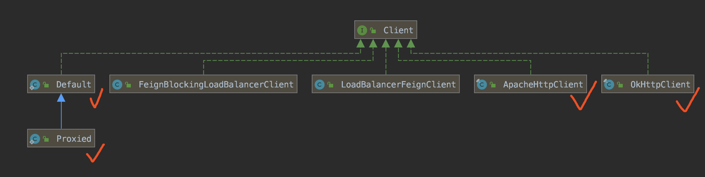

- [Client.Default](https://github.com/OpenFeign/feign/blob/819b2df8c54d9266abf4cde9b17ab7890ed95cc6/core/src/main/java/feign/Client.java#L58-L187)，基于 JDK HttpURLConnection 封装的 HTTP 客户端。
- [Client.Proxied](https://github.com/OpenFeign/feign/blob/819b2df8c54d9266abf4cde9b17ab7890ed95cc6/core/src/main/java/feign/Client.java#L189-L232)，在 Client.Default 的基础上，允许使用 `java.net.Proxy` 代理。
- [ApacheHttpClient](https://github.com/OpenFeign/feign/blob/master/httpclient/src/main/java/feign/httpclient/ApacheHttpClient.java)，基于 [Apache HttpClient](https://hc.apache.org/) 封装的 HTTP 客户端。
- [OkHttpClient](https://github.com/OpenFeign/feign/blob/master/okhttp/src/main/java/feign/okhttp/OkHttpClient.java)，基于 [OkHttp](https://square.github.io/okhttp/) 封装的 HTTP 客户端。

Spring Cloud OpenFeign 提供了上图另外 2 个 Client 实现类。

- [LoadBalancerFeignClient](https://github.com/spring-cloud/spring-cloud-openfeign/blob/2.2.x/spring-cloud-openfeign-core/src/main/java/org/springframework/cloud/openfeign/ribbon/LoadBalancerFeignClient.java)，对 Ribbon 进行集成，提供负载均衡的能力。
- [FeignBlockingLoadBalancerClient](https://github.com/spring-cloud/spring-cloud-openfeign/blob/2.2.x/spring-cloud-openfeign-core/src/main/java/org/springframework/cloud/openfeign/loadbalancer/FeignBlockingLoadBalancerClient.java)，对 [Spring Cloud LoadBalancer](https://github.com/spring-cloud/spring-cloud-commons/tree/master/spring-cloud-loadbalancer) 的 [BlockingLoadBalancerClient](https://github.com/spring-cloud/spring-cloud-commons/blob/c60df0f18e674f737c9862171275e6c795fd7b82/spring-cloud-loadbalancer/src/main/java/org/springframework/cloud/loadbalancer/blocking/client/BlockingLoadBalancerClient.java) 进行集成，提供负载均衡的能力。

这里有一个非常有趣的设计，以 LoadBalancerFeignClient 举例子，我们来看看 Feign 和 Ribbon 是怎么集成的。如下图所示：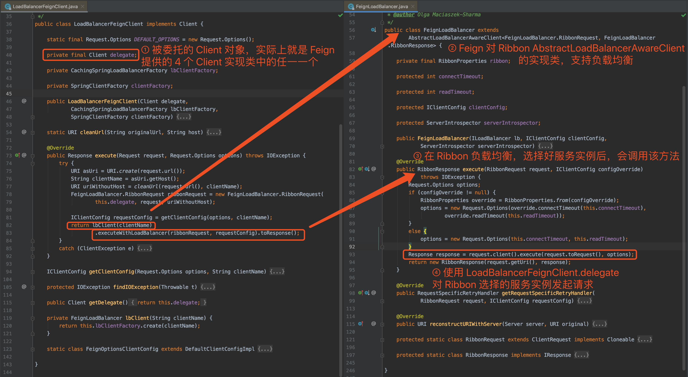

胖友按照艿艿在图中写的 ①②③④ 的顺序，进行这段逻辑的理解。本质就是 Feign `->` Ribbon `->` Fegin 的过程。如果不理解的胖友，可以在 LoadBalancerFeignClient 中打个断点，进行调试一波。

## 10.3 Contract

[Contract](https://github.com/OpenFeign/feign/blob/master/core/src/main/java/feign/Contract.java) 接口，契约，负责解析 API 接口的方法元数据，例如说注解、方法参数、方法返回类型等等。

Feign 提供了 3 个 Contract 实现类，如下图所示：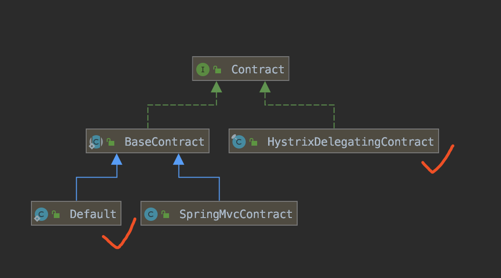

- [Contract.Default](https://github.com/OpenFeign/feign/blob/master/core/src/main/java/feign/Contract.java#L224-L312)，实现对 Feign 内置的注解的支持。
- [HystrixDelegatingContract](https://github.com/OpenFeign/feign/blob/master/hystrix/src/main/java/feign/hystrix/HystrixDelegatingContract.java)，实现对 Hystrix 的集成，主要增加对方法的返回类型为 HystrixCommand、Observable 等等时的泛型解析，从而获取到真正的返回类型。

Spring Cloud OpenFeign 提供了 [SpringMvcContract](https://github.com/spring-cloud/spring-cloud-openfeign/blob/master/spring-cloud-openfeign-core/src/main/java/org/springframework/cloud/openfeign/support/SpringMvcContract.java) 实现类，实现了对 SpringMVC 提供的注解的支持。

## 10.4 Encoder

[Encoder](https://github.com/OpenFeign/feign/blob/master/core/src/main/java/feign/codec/Encoder.java) 接口，编码器，负责将一个对象转换成 HTTP 请求体。

Feign 和 Spring Cloud OpenFeign 提供了 5 个 Encoder 实现类，如下图所示：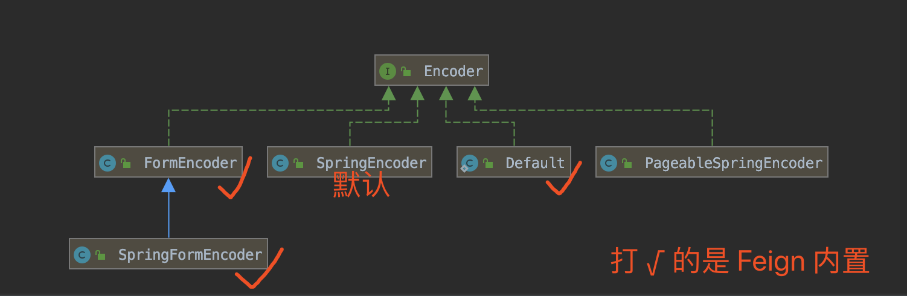

## 10.5 Decoder

[Decoder](https://github.com/OpenFeign/feign/blob/master/core/src/main/java/feign/codec/Decoder.java) 接口，编码器，负责将 HTTP 响应转换成一个对象。

Feign 和 Spring Cloud OpenFeign 提供了 8 个 Decoder 实现类，如下图所示：[Decoder 类图](http://www.iocoder.cn/images/Spring-Cloud/2020-04-01/65.png)

## 10.6 RequestInterceptor

[RequestInterceptor](https://github.com/OpenFeign/feign/blob/master/core/src/main/java/feign/RequestInterceptor.java) 接口，请求拦截器，负责对请求进行拦截，实现自定义的通用逻辑。

Feign 提供了 1 个 RequestInterceptor 实现类，如下图所示：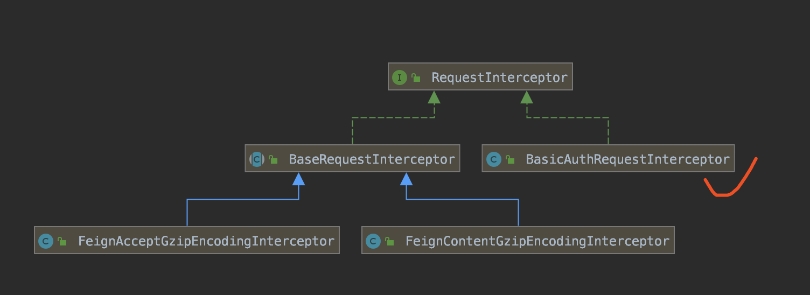

- [BasicAuthRequestInterceptor](https://github.com/OpenFeign/feign/blob/master/core/src/main/java/feign/auth/BasicAuthRequestInterceptor.java)，实现 HTTP Basic Authentication，将账号和密码编码后添加到请求头 `Authorization` 中。

Spring Cloud OpenFeign 提供了 2 个 RequestInterceptor 实现类。

- [FeignAcceptGzipEncodingInterceptor](https://github.com/spring-cloud/spring-cloud-openfeign/blob/master/spring-cloud-openfeign-core/src/main/java/org/springframework/cloud/openfeign/encoding/FeignAcceptGzipEncodingInterceptor.java)，添加 `gzip, deflate` 到请求头 `Accept-Encoding` 中，表示支持响应结果进行 GZIP 压缩。
- [FeignContentGzipEncodingInterceptor](https://github.com/spring-cloud/spring-cloud-openfeign/blob/master/spring-cloud-openfeign-core/src/main/java/org/springframework/cloud/openfeign/encoding/FeignContentGzipEncodingInterceptor.java)，当 HTTP 请求体的大小超过到达阀值，进行 GZIP 压缩。

## 10.7 Logger

[Logger](https://github.com/OpenFeign/feign/blob/master/core/src/main/java/feign/Logger.java) 抽象类，日志记录器，负责请求信息的日志打印。

Feign 提供了 4 种 Logger 实现类，如下图所示：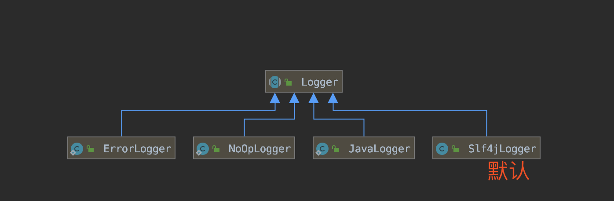

## 10.8 小结

Feign 的原理与源码并不复杂，建议胖友可以阅读下[《Spring Cloud Feign 设计原理》](http://www.iocoder.cn/Fight/Spring-Cloud-Feign-design-principles/?self) 文章，重点要理解两点：

- Feign 是如何给 Java API 接口创建动态代理，从而生成调用远程 HTTP API 接口的实现类。
- Feign 和 Ribbon 是如何集成的，并实现前者负责 HTTP 接口的声明与调用，后者负责服务实例的负载均衡。

# 666. 彩蛋

至此，我们已经完成 Spring Cloud OpenFeign 的学习。如下是 Nacos 相关的官方文档：

- [《Feign 官方文档》](https://github.com/OpenFeign/feign)
- [《Spring Cloud 官方文档 —— Spring Cloud OpenFeign》](https://cloud.spring.io/spring-cloud-openfeign/reference/html/)
- [《Spring Cloud 中文文档 —— Spring Cloud OpenFeign》](https://www.docs4dev.com/docs/zh/spring-cloud/Greenwich.RELEASE/reference/multi__spring_cloud_openfeign.html#iv-spring-cloud-openfeign)
